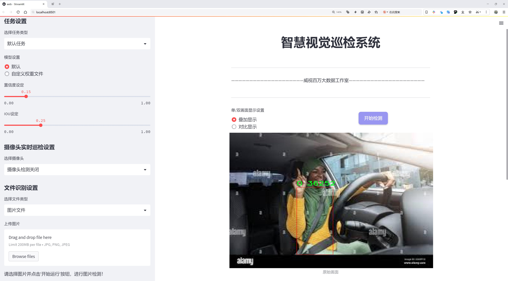
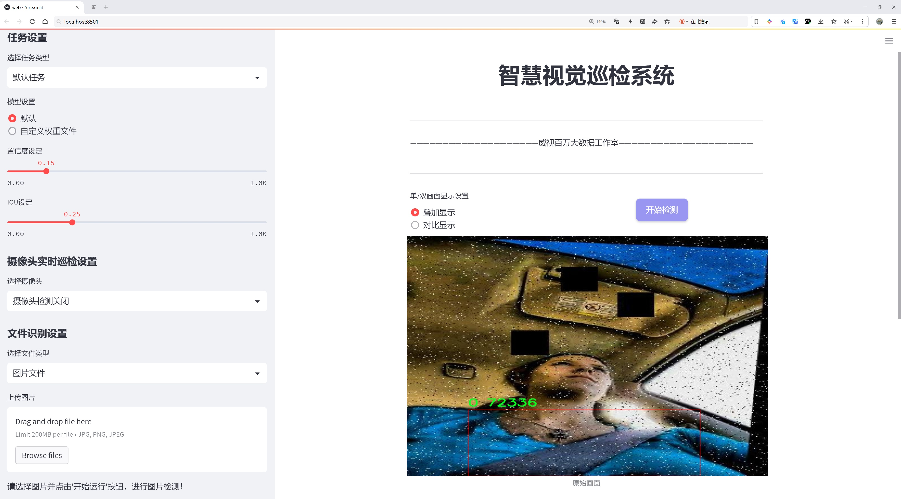
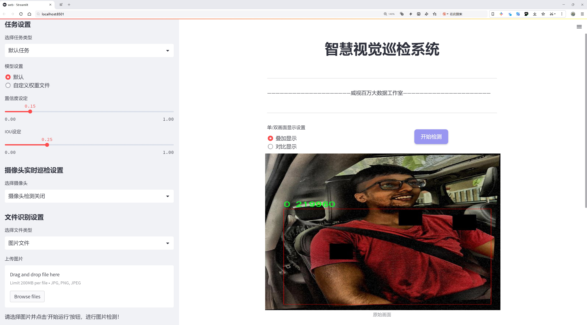
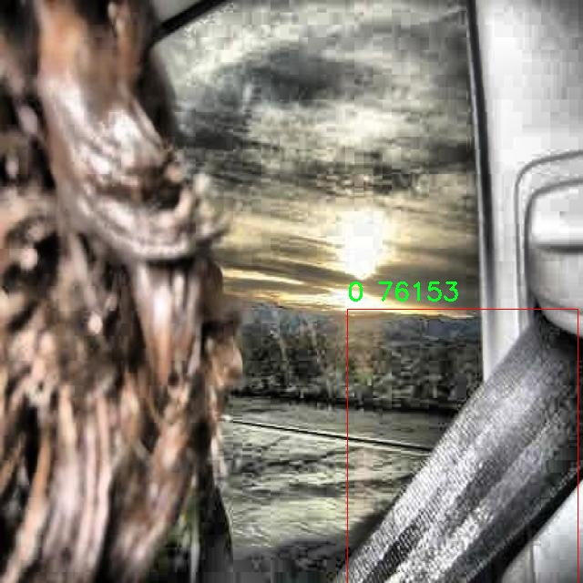
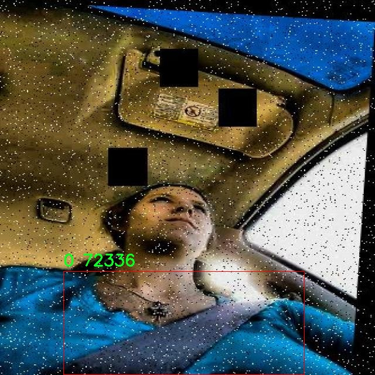
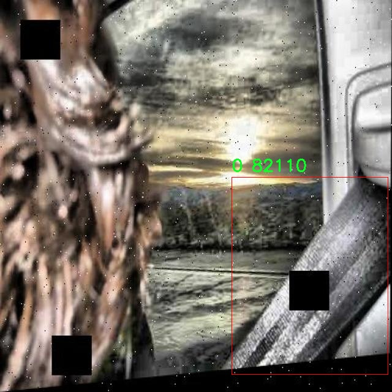
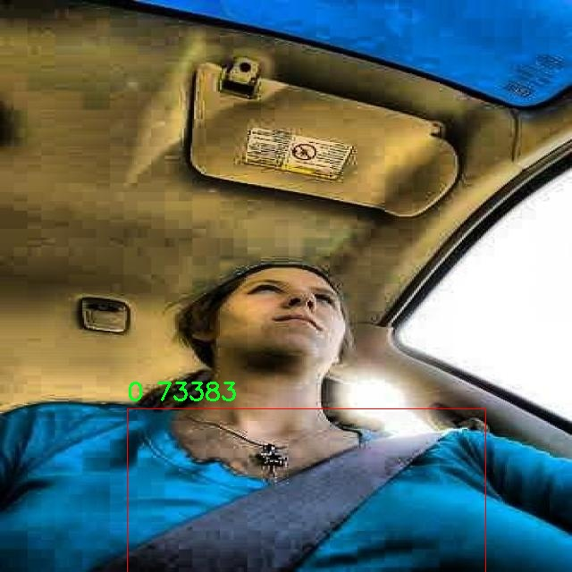
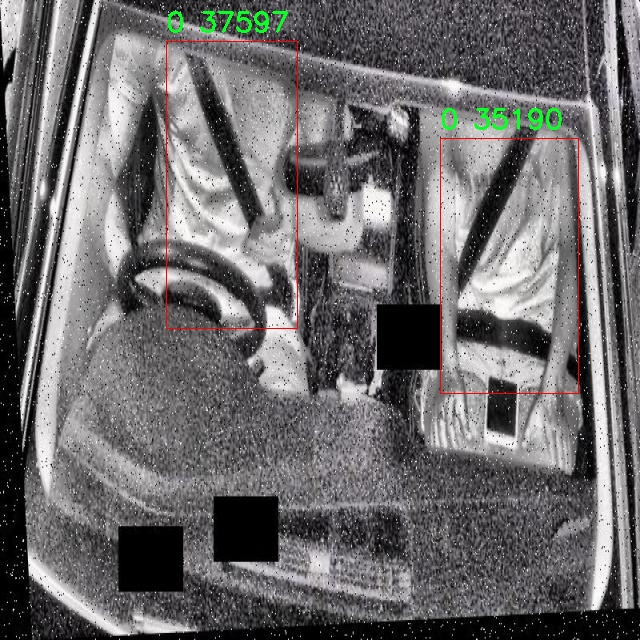

# 安全带检测检测系统源码分享
 # [一条龙教学YOLOV8标注好的数据集一键训练_70+全套改进创新点发刊_Web前端展示]

### 1.研究背景与意义

项目参考[AAAI Association for the Advancement of Artificial Intelligence](https://gitee.com/qunmasj/projects)

项目来源[AACV Association for the Advancement of Computer Vision](https://kdocs.cn/l/cszuIiCKVNis)

研究背景与意义

随着交通安全意识的提高，安全带的使用已成为减少交通事故伤亡的重要措施之一。根据世界卫生组织的统计数据，佩戴安全带可以显著降低在交通事故中受伤或死亡的风险。然而，尽管安全带的使用在许多国家和地区得到了推广，仍然存在部分驾驶员和乘客在行车过程中未系安全带的现象。这不仅影响了交通安全，也给社会带来了巨大的经济负担。因此，开发一种高效、准确的安全带检测系统，能够实时监测车辆内乘员的安全带使用情况，具有重要的现实意义。

近年来，深度学习技术的迅猛发展为物体检测领域带来了新的机遇。YOLO（You Only Look Once）系列模型因其高效的实时检测能力和较高的准确率，已成为物体检测任务中的重要工具。YOLOv8作为该系列的最新版本，进一步提升了模型的性能，尤其在小物体检测和复杂场景下的表现上有了显著改善。基于YOLOv8的安全带检测系统，能够通过对车辆内部图像的实时分析，自动识别乘员是否佩戴安全带，从而为交通安全管理提供技术支持。

本研究将利用一个包含2300张图像的安全带数据集进行模型训练和评估。该数据集虽然规模相对较小，但其专注于安全带这一单一类别的特性，使得模型在该特定任务上的学习和优化更加集中。通过对该数据集的深入分析与处理，结合YOLOv8的强大功能，我们期望能够在安全带检测的准确性和实时性上取得突破。此外，数据集中的图像多样性将有助于模型在不同光照、角度和场景下的鲁棒性提升，从而提高其在实际应用中的有效性。

本研究的意义不仅在于技术层面的创新，更在于其对社会安全的积极影响。通过实时监测安全带的使用情况，相关部门可以及时采取措施，提醒未系安全带的乘员，降低交通事故的发生率。同时，该系统的推广应用也有助于提高公众对安全带使用重要性的认识，进一步增强交通安全文化。此外，基于YOLOv8的安全带检测系统可以与智能交通系统相结合，为未来智能驾驶和自动驾驶技术的发展提供支持。

综上所述，基于改进YOLOv8的安全带检测系统的研究，不仅具有重要的学术价值，也对提升交通安全、降低事故损失具有深远的社会意义。通过这一研究，我们希望能够为安全带的普及和使用提供更为有效的技术手段，为构建更加安全的交通环境贡献力量。

### 2.图片演示







##### 注意：由于此博客编辑较早，上面“2.图片演示”和“3.视频演示”展示的系统图片或者视频可能为老版本，新版本在老版本的基础上升级如下：（实际效果以升级的新版本为准）

  （1）适配了YOLOV8的“目标检测”模型和“实例分割”模型，通过加载相应的权重（.pt）文件即可自适应加载模型。

  （2）支持“图片识别”、“视频识别”、“摄像头实时识别”三种识别模式。

  （3）支持“图片识别”、“视频识别”、“摄像头实时识别”三种识别结果保存导出，解决手动导出（容易卡顿出现爆内存）存在的问题，识别完自动保存结果并导出到tempDir中。

  （4）支持Web前端系统中的标题、背景图等自定义修改，后面提供修改教程。

  另外本项目提供训练的数据集和训练教程,暂不提供权重文件（best.pt）,需要您按照教程进行训练后实现图片演示和Web前端界面演示的效果。

### 3.视频演示

[3.1 视频演示](https://www.bilibili.com/video/BV19EsYeNEGw/)

### 4.数据集信息展示

##### 4.1 本项目数据集详细数据（类别数＆类别名）

nc: 1
names: ['0']


##### 4.2 本项目数据集信息介绍

数据集信息展示

在现代智能交通系统中，安全带的检测与识别是提升车辆安全性的重要环节。为此，构建一个高效的安全带检测系统显得尤为重要。本研究所使用的数据集名为“Seatbelt”，专门用于训练和改进YOLOv8模型，以实现对安全带的精准检测。该数据集的设计旨在提供丰富的样本，以帮助模型学习在不同场景下的安全带特征，从而提高其在实际应用中的准确性和鲁棒性。

“Seatbelt”数据集包含了多样化的图像数据，涵盖了各种车辆内部环境和不同类型的安全带。这些图像不仅包括了车辆在静止状态下的安全带样本，还涵盖了车辆行驶过程中乘客的安全带佩戴情况。这种多样性确保了模型能够适应不同的驾驶场景，进而提高其在真实世界中的应用效果。数据集中包含的类别数量为1，具体类别标记为“0”，代表安全带的存在与否。这种简化的类别设置使得模型的训练过程更加专注，能够有效减少误判和漏判的情况。

为了确保数据集的质量和多样性，数据采集过程中采取了多种手段，包括在不同的光照条件、天气状况和时间段下拍摄图像。此外，数据集中还包含了不同车型和不同乘客体型的安全带样本，以进一步增强模型的泛化能力。这种全面的样本覆盖使得YOLOv8模型在训练过程中能够学习到更为丰富的特征信息，从而在实际应用中更好地适应各种复杂情况。

在数据标注方面，所有图像均经过严格的人工审核，确保每个样本的标注准确无误。标注过程中，专业的标注团队对每个图像中的安全带进行了精确的框选，并确保其与实际情况相符。这一过程不仅提高了数据集的可靠性，也为后续的模型训练提供了坚实的基础。

此外，为了提升模型的训练效果，数据集还进行了数据增强处理，包括旋转、缩放、裁剪和颜色变换等操作。这些增强技术能够有效扩展数据集的规模，使得模型在训练过程中接触到更多的变异样本，从而提高其对未知数据的适应能力。通过这些措施，研究团队希望能够显著提升YOLOv8在安全带检测任务中的性能。

综上所述，“Seatbelt”数据集为安全带检测系统的开发提供了强有力的支持。通过对多样化样本的精心设计和严格的标注过程，该数据集不仅为YOLOv8模型的训练奠定了基础，也为未来在智能交通领域的应用提供了广阔的前景。随着技术的不断进步，期待该系统能够在实际应用中发挥重要作用，为提高交通安全贡献力量。











### 5.全套项目环境部署视频教程（零基础手把手教学）

[5.1 环境部署教程链接（零基础手把手教学）](https://www.ixigua.com/7404473917358506534?logTag=c807d0cbc21c0ef59de5)


[5.2 安装Python虚拟环境创建和依赖库安装视频教程链接（零基础手把手教学）](https://www.ixigua.com/7404474678003106304?logTag=1f1041108cd1f708b01a)

### 6.手把手YOLOV8训练视频教程（零基础小白有手就能学会）

[6.1 手把手YOLOV8训练视频教程（零基础小白有手就能学会）](https://www.ixigua.com/7404477157818401292?logTag=d31a2dfd1983c9668658)

### 7.70+种全套YOLOV8创新点代码加载调参视频教程（一键加载写好的改进模型的配置文件）

[7.1 70+种全套YOLOV8创新点代码加载调参视频教程（一键加载写好的改进模型的配置文件）](https://www.ixigua.com/7404478314661806627?logTag=29066f8288e3f4eea3a4)

### 8.70+种全套YOLOV8创新点原理讲解（非科班也可以轻松写刊发刊，V10版本正在科研待更新）

由于篇幅限制，每个创新点的具体原理讲解就不一一展开，具体见下列网址中的创新点对应子项目的技术原理博客网址【Blog】：


[8.1 70+种全套YOLOV8创新点原理讲解链接](https://gitee.com/qunmasj/good)

### 9.系统功能展示（检测对象为举例，实际内容以本项目数据集为准）

图9.1.系统支持检测结果表格显示

  图9.2.系统支持置信度和IOU阈值手动调节

  图9.3.系统支持自定义加载权重文件best.pt(需要你通过步骤5中训练获得)

  图9.4.系统支持摄像头实时识别

  图9.5.系统支持图片识别

  图9.6.系统支持视频识别

  图9.7.系统支持识别结果文件自动保存

  图9.8.系统支持Excel导出检测结果数据


### 10.原始YOLOV8算法原理

原始YOLOv8算法原理

YOLOv8作为YOLO系列的最新版本，继承并改进了前几代模型的设计理念，旨在实现更高效的目标检测和图像分割任务。其架构由三个主要部分组成：Backbone、Neck和Head，这三部分共同协作，以实现从输入图像到目标检测结果的高效转换。

在特征提取阶段，YOLOv8s采用了CSPDarknet（Cross Stage Partial Darknet）作为其Backbone网络。CSPDarknet的设计理念是通过将网络分为两个部分，并在每个部分中引入多个残差块，来增强特征提取的能力。与YOLOv5相比，YOLOv8s使用了C2f模块替代了C3模块。C2f模块的创新在于将输入特征图分为两个分支，每个分支通过卷积层进行降维处理，同时引入了v8_C2fBottleneck层。这些Bottleneck层的输出同样被视为一个分支，经过堆叠后形成更高维度的特征图。这种结构不仅提升了特征图的维度，还通过卷积层的融合，增加了梯度流的信息，从而使得模型在训练过程中能够更有效地学习到特征。

在特征提取的过程中，YOLOv8s还引入了快速空间金字塔池化（SPPF）结构，以提高对不同尺度特征的提取能力。SPPF通过有效地减少模型的参数量和计算量，显著提升了特征提取的效率。这一创新使得YOLOv8在处理复杂场景时，能够更好地捕捉到多尺度的目标信息，进而提高了检测的准确性。

在目标检测阶段，YOLOv8s采用了特征金字塔网络（FPN）和路径聚合网络（PAN）的组合结构。这一结构通过多个卷积层和池化层的配合，能够有效地处理和压缩特征图，从而提取出更具判别性的特征。通过这种多层次的特征融合，YOLOv8能够更好地理解图像中的目标信息，进而提高检测的精度。

值得注意的是，YOLOv8s采用了一种基于无锚框（Anchor-Free）的检测方式。这一方式直接预测目标的中心点及其宽高比例，省去了传统Anchor框的设置和调整。这一创新不仅减少了Anchor框的数量，还提高了检测的速度和准确度。通过这种简化的检测流程，YOLOv8能够在实时应用中表现出色，尤其是在需要快速响应的场景中。

YOLOv8的设计还考虑到了模型的可扩展性和灵活性。其模型设置包括depth_factor、width_factor和ratio等参数，这些参数允许用户根据具体需求调整模型的深度和宽度。通过适当的设置，用户可以在不同的硬件平台上运行YOLOv8，满足从移动设备到高性能服务器的多种应用场景。

此外，YOLOv8还支持小目标检测和高分辨率图像的处理。这一特性使得YOLOv8在复杂环境下的表现更加优异，能够有效识别那些在传统模型中容易被忽视的小目标。这一能力的提升，得益于YOLOv8在模型结构上的优化以及特征提取和融合策略的改进。

总的来说，YOLOv8作为YOLO系列的最新进展，凭借其高效的特征提取、灵活的目标检测机制以及对小目标的良好支持，成为了计算机视觉领域中一种极具竞争力的模型。其在精度和速度上的双重优势，使得YOLOv8在各种实际应用中表现出色，广泛应用于自动驾驶、安防监控、智能交通等多个领域。随着YOLOv8的不断发展和优化，未来其在目标检测和图像分割任务中的应用前景将更加广阔。


### 11.项目核心源码讲解（再也不用担心看不懂代码逻辑）

#### 11.1 code\chinese_name_list.py

以下是对提供代码的逐行分析和核心部分的保留，同时添加了详细的中文注释：

```python
# -*- coding: utf-8 -*-
# 指定文件编码为utf-8，以支持中文字符

# 创建一个字典，包含中文名称与其对应的英文标签
Chinese_name = {'person': "人"}

# 从字典中提取所有的中文名称，生成一个列表
Label_list = list(Chinese_name.values())

# 现在，Label_list 中包含了所有的中文标签
# 在这个例子中，Label_list 的内容将是 ["人"]
```

在这个代码中，核心部分是字典的创建和从字典中提取值的过程。通过注释，清晰地解释了每一行代码的功能和目的。

这个文件的代码主要是定义了一个包含中文名称的字典和一个列表。首先，文件开头的 `# -*- coding: utf-8 -*-` 是一个编码声明，表示这个文件使用 UTF-8 编码，这对于处理中文字符是非常重要的。

接下来，代码中定义了一个字典 `Chinese_name`，它的键是 `'person'`，对应的值是一个中文字符 `"人"`。这个字典的用途可能是为了将某些英文词汇与其对应的中文翻译进行映射。

然后，代码通过 `list(Chinese_name.values())` 创建了一个列表 `Label_list`，这个列表包含了字典 `Chinese_name` 中所有的值。在这个例子中，`Label_list` 将会是一个包含单个元素的列表，即 `["人"]`。

整体来看，这段代码的功能是将一个英文词汇（在这里是 "person"）与其中文翻译（"人"）进行关联，并将所有的中文翻译存储在一个列表中，以便后续使用。这样的结构在需要多语言支持的程序中是非常常见的。

#### 11.2 ui.py

```python
import sys
import subprocess

def run_script(script_path):
    """
    使用当前 Python 环境运行指定的脚本。

    Args:
        script_path (str): 要运行的脚本路径

    Returns:
        None
    """
    # 获取当前 Python 解释器的路径
    python_path = sys.executable

    # 构建运行命令，使用 streamlit 运行指定的脚本
    command = f'"{python_path}" -m streamlit run "{script_path}"'

    # 执行命令并等待其完成
    result = subprocess.run(command, shell=True)
    
    # 检查命令执行结果，如果返回码不为0，表示出错
    if result.returncode != 0:
        print("脚本运行出错。")


# 实例化并运行应用
if __name__ == "__main__":
    # 指定要运行的脚本路径
    script_path = "web.py"  # 这里可以直接指定脚本名，假设它在当前目录

    # 调用函数运行脚本
    run_script(script_path)
```

### 代码核心部分及注释说明：

1. **导入模块**：
   - `import sys`: 导入系统模块，用于获取当前 Python 解释器的路径。
   - `import subprocess`: 导入子进程模块，用于执行外部命令。

2. **定义 `run_script` 函数**：
   - 该函数接收一个参数 `script_path`，表示要运行的 Python 脚本的路径。
   - 使用 `sys.executable` 获取当前 Python 解释器的路径。
   - 构建命令字符串，使用 `streamlit` 模块运行指定的脚本。
   - 使用 `subprocess.run` 执行命令，并等待其完成。
   - 检查命令的返回码，如果不为0，打印错误信息。

3. **主程序入口**：
   - 使用 `if __name__ == "__main__":` 确保只有在直接运行该脚本时才会执行以下代码。
   - 指定要运行的脚本路径 `script_path`，这里假设脚本在当前目录。
   - 调用 `run_script` 函数，传入脚本路径以执行该脚本。

这个程序文件名为 `ui.py`，其主要功能是使用当前的 Python 环境来运行一个指定的脚本，具体是一个名为 `web.py` 的文件。程序首先导入了必要的模块，包括 `sys`、`os` 和 `subprocess`，以及一个自定义的 `abs_path` 函数，用于获取脚本的绝对路径。

在 `run_script` 函数中，首先获取当前 Python 解释器的路径，这通过 `sys.executable` 实现。接着，构建一个命令字符串，该命令用于调用 `streamlit` 模块来运行指定的脚本。`streamlit` 是一个用于构建数据应用的库，命令格式为 `python -m streamlit run <script_path>`。

然后，使用 `subprocess.run` 方法执行构建好的命令，`shell=True` 参数允许在 shell 中执行命令。执行后，程序检查返回的状态码，如果返回码不为 0，表示脚本运行出错，程序会打印出相应的错误信息。

在文件的最后部分，使用 `if __name__ == "__main__":` 来确保只有在直接运行该脚本时才会执行后面的代码。此时，指定了要运行的脚本路径为 `web.py`，并调用 `run_script` 函数来执行这个脚本。

总体来说，这个程序的作用是为用户提供一个简单的接口，通过它可以方便地运行一个 Streamlit 应用，具体的应用逻辑则在 `web.py` 中实现。

#### 11.3 70+种YOLOv8算法改进源码大全和调试加载训练教程（非必要）\ultralytics\models\rtdetr\val.py

以下是代码中最核心的部分，并附上详细的中文注释：

```python
import torch
from ultralytics.data import YOLODataset
from ultralytics.models.yolo.detect import DetectionValidator
from ultralytics.utils import ops

class RTDETRDataset(YOLODataset):
    """
    RT-DETR数据集类，继承自YOLODataset类。
    该类专为RT-DETR目标检测模型设计，优化了实时检测和跟踪任务。
    """

    def __init__(self, *args, data=None, **kwargs):
        """初始化RTDETRDataset类，调用父类构造函数。"""
        super().__init__(*args, data=data, use_segments=False, use_keypoints=False, **kwargs)

    def load_image(self, i, rect_mode=False):
        """从数据集中加载索引为'i'的图像，返回图像及其调整后的尺寸。"""
        return super().load_image(i=i, rect_mode=rect_mode)

    def build_transforms(self, hyp=None):
        """构建数据预处理变换，主要用于评估阶段。"""
        if self.augment:
            transforms = v8_transforms(self, self.imgsz, hyp, stretch=True)
        else:
            transforms = Compose([])  # 不进行任何变换
        transforms.append(
            Format(bbox_format='xywh',  # 边界框格式
                   normalize=True,  # 归一化
                   return_mask=self.use_segments,  # 是否返回分割掩码
                   return_keypoint=self.use_keypoints,  # 是否返回关键点
                   batch_idx=True,  # 是否返回批次索引
                   mask_ratio=hyp.mask_ratio,  # 掩码比例
                   mask_overlap=hyp.overlap_mask))  # 掩码重叠
        return transforms


class RTDETRValidator(DetectionValidator):
    """
    RTDETRValidator类扩展了DetectionValidator类，提供专门针对RT-DETR模型的验证功能。
    该类允许构建RTDETR特定的数据集进行验证，应用非极大值抑制进行后处理，并相应更新评估指标。
    """

    def build_dataset(self, img_path, mode='val', batch=None):
        """
        构建RTDETR数据集。

        参数:
            img_path (str): 包含图像的文件夹路径。
            mode (str): 模式，'train'或'val'，用户可以为每种模式自定义不同的增强。
            batch (int, optional): 批次大小，仅适用于'rect'模式。默认为None。
        """
        return RTDETRDataset(
            img_path=img_path,
            imgsz=self.args.imgsz,
            batch_size=batch,
            augment=False,  # 不进行增强
            hyp=self.args,
            rect=False,  # 不进行矩形调整
            cache=self.args.cache or None,
            prefix=colorstr(f'{mode}: '),
            data=self.data)

    def postprocess(self, preds):
        """对预测输出应用非极大值抑制。"""
        bs, _, nd = preds[0].shape  # bs: 批次大小, nd: 预测维度
        bboxes, scores = preds[0].split((4, nd - 4), dim=-1)  # 分离边界框和分数
        bboxes *= self.args.imgsz  # 将边界框缩放到原始图像大小
        outputs = [torch.zeros((0, 6), device=bboxes.device)] * bs  # 初始化输出
        for i, bbox in enumerate(bboxes):  # 遍历每个边界框
            bbox = ops.xywh2xyxy(bbox)  # 转换边界框格式
            score, cls = scores[i].max(-1)  # 获取最大分数和对应类别
            pred = torch.cat([bbox, score[..., None], cls[..., None]], dim=-1)  # 合并边界框、分数和类别
            pred = pred[score.argsort(descending=True)]  # 按分数排序
            outputs[i] = pred  # 保存预测结果

        return outputs

    def update_metrics(self, preds, batch):
        """更新评估指标。"""
        for si, pred in enumerate(preds):
            idx = batch['batch_idx'] == si  # 获取当前批次的索引
            cls = batch['cls'][idx]  # 获取当前批次的类别
            bbox = batch['bboxes'][idx]  # 获取当前批次的边界框
            nl, npr = cls.shape[0], pred.shape[0]  # nl: 标签数量, npr: 预测数量
            shape = batch['ori_shape'][si]  # 获取原始图像的形状
            correct_bboxes = torch.zeros(npr, self.niou, dtype=torch.bool, device=self.device)  # 初始化正确边界框
            self.seen += 1  # 增加已处理的样本数量

            if npr == 0:  # 如果没有预测
                if nl:
                    self.stats.append((correct_bboxes, *torch.zeros((2, 0), device=self.device), cls.squeeze(-1)))
                continue

            # 处理预测
            if self.args.single_cls:
                pred[:, 5] = 0  # 单类情况
            predn = pred.clone()  # 克隆预测
            predn[..., [0, 2]] *= shape[1] / self.args.imgsz  # 转换为原始空间
            predn[..., [1, 3]] *= shape[0] / self.args.imgsz  # 转换为原始空间

            # 评估
            if nl:
                tbox = ops.xywh2xyxy(bbox)  # 转换目标边界框格式
                tbox[..., [0, 2]] *= shape[1]  # 转换为原始空间
                tbox[..., [1, 3]] *= shape[0]  # 转换为原始空间
                labelsn = torch.cat((cls, tbox), 1)  # 合并类别和目标边界框
                correct_bboxes = self._process_batch(predn.float(), labelsn)  # 处理批次
            self.stats.append((correct_bboxes, pred[:, 4], pred[:, 5], cls.squeeze(-1)))  # 更新统计信息
```

### 代码说明：
1. **RTDETRDataset** 类：用于处理RT-DETR模型的数据集，继承自YOLODataset，包含图像加载和数据预处理的方法。
2. **RTDETRValidator** 类：用于验证RT-DETR模型的性能，扩展了DetectionValidator类，包含构建数据集、后处理预测和更新评估指标的方法。
3. **load_image** 方法：从数据集中加载指定索引的图像。
4. **build_transforms** 方法：构建数据预处理变换。
5. **postprocess** 方法：对模型的预测结果进行非极大值抑制，去除冗余的边界框。
6. **update_metrics** 方法：更新模型的评估指标，计算正确的边界框数量等。

该程序文件是一个用于YOLOv8算法的验证模块，主要实现了RT-DETR（实时检测与跟踪）模型的验证功能。文件中定义了两个主要的类：`RTDETRDataset`和`RTDETRValidator`，它们分别用于数据集的构建和模型的验证。

`RTDETRDataset`类继承自`YOLODataset`，专门为RT-DETR模型设计。该类的构造函数调用了父类的初始化方法，并设置了一些参数，如不使用分段和关键点。它重写了`load_image`方法，以加载指定索引的图像，并提供了`build_transforms`方法，用于构建图像变换流程。该方法根据是否启用增强和矩形模式来设置不同的图像处理方式，并最终返回一个变换列表，其中包括了格式化边界框的操作。

`RTDETRValidator`类继承自`DetectionValidator`，提供了针对RT-DETR模型的验证功能。它的`build_dataset`方法用于构建RT-DETR数据集，支持训练和验证模式的不同增强设置。`postprocess`方法实现了非极大值抑制（NMS），用于处理模型的预测输出，以去除冗余的边界框。该方法将预测的边界框和分数分开，并通过置信度排序来过滤和整理最终的输出。

此外，`update_metrics`方法用于更新验证过程中的评估指标。它会根据预测结果和真实标签计算正确的边界框，并更新统计信息。该方法还支持保存预测结果为JSON或TXT格式，便于后续分析。

整体来看，该文件为RT-DETR模型的验证提供了完整的流程，包括数据集的构建、图像的处理、预测结果的后处理以及评估指标的更新，适用于实时目标检测和跟踪任务。

#### 11.4 code\ultralytics\utils\errors.py

```python
# 导入Ultralytics库中的emojis工具，用于处理消息中的表情符号
from ultralytics.utils import emojis

# 自定义异常类，用于处理与Ultralytics YOLO模型获取相关的错误
class HUBModelError(Exception):
    """
    自定义异常类，用于处理与模型获取相关的错误。

    当请求的模型未找到或无法检索时，将引发此异常。
    消息经过处理，以包含表情符号，从而改善用户体验。

    属性:
        message (str): 引发异常时显示的错误消息。

    注意:
        消息会通过'ultralytics.utils'包中的'emojis'函数自动处理。
    """

    def __init__(self, message="Model not found. Please check model URL and try again."):
        """当模型未找到时创建异常。"""
        # 调用父类的构造函数，并使用emojis函数处理消息
        super().__init__(emojis(message))
``` 

### 代码核心部分及注释说明：
1. **导入emojis工具**：用于在异常消息中添加表情符号，以提升用户体验。
2. **HUBModelError类**：自定义异常类，继承自Python内置的Exception类，专门用于处理模型获取时的错误。
3. **构造函数**：在构造函数中，默认的错误消息被定义，并通过`emojis`函数进行处理，确保消息中包含表情符号，增强可读性和友好性。

这个程序文件定义了一个自定义异常类 `HUBModelError`，用于处理与 Ultralytics YOLO 模型获取相关的错误。该异常类主要用于在请求的模型未找到或无法检索时引发异常。

在这个类中，构造函数 `__init__` 接受一个可选的参数 `message`，默认值为 "Model not found. Please check model URL and try again."。当该异常被引发时，用户将看到这个错误信息。值得注意的是，传入的错误信息会通过 `ultralytics.utils` 包中的 `emojis` 函数进行处理，这样可以在错误消息中添加表情符号，从而提升用户体验。

该类继承自 Python 的内置 `Exception` 类，因此可以像其他异常一样使用，能够在代码中捕获和处理特定的错误情况。通过这种方式，开发者可以更好地管理模型获取过程中的错误，并提供更友好的反馈给用户。

#### 11.5 train.py

以下是经过简化和注释的核心代码部分，主要关注于YOLO检测模型的训练过程。

```python
import random
import numpy as np
import torch.nn as nn
from ultralytics.data import build_dataloader, build_yolo_dataset
from ultralytics.engine.trainer import BaseTrainer
from ultralytics.models import yolo
from ultralytics.nn.tasks import DetectionModel
from ultralytics.utils import LOGGER, RANK
from ultralytics.utils.torch_utils import de_parallel, torch_distributed_zero_first

class DetectionTrainer(BaseTrainer):
    """
    基于检测模型的训练类，继承自BaseTrainer类。
    """

    def build_dataset(self, img_path, mode="train", batch=None):
        """
        构建YOLO数据集。

        参数:
            img_path (str): 包含图像的文件夹路径。
            mode (str): 模式，可以是'train'或'val'，用于自定义不同的增强方式。
            batch (int, optional): 批量大小，仅用于'rect'模式。默认为None。
        """
        gs = max(int(de_parallel(self.model).stride.max() if self.model else 0), 32)  # 获取模型的最大步幅
        return build_yolo_dataset(self.args, img_path, batch, self.data, mode=mode, rect=mode == "val", stride=gs)

    def get_dataloader(self, dataset_path, batch_size=16, rank=0, mode="train"):
        """构建并返回数据加载器。"""
        assert mode in ["train", "val"]  # 确保模式有效
        with torch_distributed_zero_first(rank):  # 仅在DDP情况下初始化数据集
            dataset = self.build_dataset(dataset_path, mode, batch_size)  # 构建数据集
        shuffle = mode == "train"  # 训练模式下打乱数据
        workers = self.args.workers if mode == "train" else self.args.workers * 2  # 设置工作线程数
        return build_dataloader(dataset, batch_size, workers, shuffle, rank)  # 返回数据加载器

    def preprocess_batch(self, batch):
        """对图像批次进行预处理，包括缩放和转换为浮点数。"""
        batch["img"] = batch["img"].to(self.device, non_blocking=True).float() / 255  # 将图像转换为浮点数并归一化
        if self.args.multi_scale:  # 如果启用多尺度
            imgs = batch["img"]
            sz = (
                random.randrange(self.args.imgsz * 0.5, self.args.imgsz * 1.5 + self.stride)
                // self.stride
                * self.stride
            )  # 随机选择新的图像大小
            sf = sz / max(imgs.shape[2:])  # 计算缩放因子
            if sf != 1:
                ns = [
                    math.ceil(x * sf / self.stride) * self.stride for x in imgs.shape[2:]
                ]  # 计算新的形状
                imgs = nn.functional.interpolate(imgs, size=ns, mode="bilinear", align_corners=False)  # 调整图像大小
            batch["img"] = imgs  # 更新批次图像
        return batch

    def get_model(self, cfg=None, weights=None, verbose=True):
        """返回YOLO检测模型。"""
        model = DetectionModel(cfg, nc=self.data["nc"], verbose=verbose and RANK == -1)  # 创建检测模型
        if weights:
            model.load(weights)  # 加载权重
        return model

    def plot_training_samples(self, batch, ni):
        """绘制带有注释的训练样本。"""
        plot_images(
            images=batch["img"],
            batch_idx=batch["batch_idx"],
            cls=batch["cls"].squeeze(-1),
            bboxes=batch["bboxes"],
            paths=batch["im_file"],
            fname=self.save_dir / f"train_batch{ni}.jpg",
            on_plot=self.on_plot,
        )

    def plot_metrics(self):
        """从CSV文件中绘制指标。"""
        plot_results(file=self.csv, on_plot=self.on_plot)  # 保存结果图
```

### 代码说明：
1. **DetectionTrainer类**：继承自`BaseTrainer`，用于YOLO模型的训练。
2. **build_dataset方法**：构建YOLO数据集，接受图像路径、模式和批量大小作为参数。
3. **get_dataloader方法**：创建数据加载器，支持分布式训练。
4. **preprocess_batch方法**：对输入的图像批次进行预处理，包括归一化和多尺度调整。
5. **get_model方法**：返回YOLO检测模型，支持加载预训练权重。
6. **plot_training_samples和plot_metrics方法**：用于可视化训练样本和训练指标。

这些核心部分构成了YOLO模型训练的基础，处理数据集的构建、数据加载、图像预处理和模型管理等关键功能。

这个程序文件 `train.py` 是一个用于训练 YOLO（You Only Look Once）目标检测模型的实现，继承自 `BaseTrainer` 类。它主要包含了数据集构建、数据加载、模型设置、训练过程中的损失计算和可视化等功能。

首先，程序导入了一些必要的库和模块，包括数学运算、随机数生成、深度学习框架 PyTorch 的神经网络模块，以及 Ultralytics 提供的各种工具和函数。这些工具和函数帮助构建数据集、加载数据、定义模型、记录日志等。

在 `DetectionTrainer` 类中，`build_dataset` 方法用于构建 YOLO 数据集。它接收图像路径、模式（训练或验证）和批次大小作为参数，并根据这些参数调用 `build_yolo_dataset` 函数来创建数据集。该方法还会根据模型的步幅（stride）来调整数据集的构建。

`get_dataloader` 方法用于构建并返回数据加载器。它会根据传入的模式（训练或验证）来选择合适的参数，并在分布式训练的情况下确保数据集只初始化一次。数据加载器会在训练模式下打乱数据顺序，而在验证模式下则不会。

`preprocess_batch` 方法负责对图像批次进行预处理，包括将图像缩放到适当的大小并转换为浮点数。该方法还支持多尺度训练，即在每个训练周期随机选择图像的大小，以提高模型的鲁棒性。

`set_model_attributes` 方法用于设置模型的属性，包括类别数量和类别名称。这些信息会被传递给模型，以便于后续的训练和验证。

`get_model` 方法返回一个 YOLO 检测模型，并可以加载预训练的权重。这个方法确保模型的配置和类别信息正确设置。

`get_validator` 方法返回一个用于验证模型性能的 `DetectionValidator` 实例，记录损失值并保存结果。

`label_loss_items` 方法用于返回一个包含训练损失项的字典，便于后续的损失记录和分析。

`progress_string` 方法生成一个格式化的字符串，用于显示训练进度，包括当前的训练轮次、GPU 内存使用情况、损失值、实例数量和图像大小等信息。

`plot_training_samples` 方法用于绘制训练样本及其标注信息，以便于可视化训练过程中的样本质量。

最后，`plot_metrics` 和 `plot_training_labels` 方法用于从 CSV 文件中绘制训练过程中的指标，并生成带有标注的训练图像。这些可视化工具可以帮助开发者更好地理解模型的训练情况和性能。

总体而言，这个文件实现了 YOLO 模型训练的核心功能，涵盖了数据处理、模型构建、训练过程监控和结果可视化等多个方面。

#### 11.6 code\ultralytics\models\rtdetr\predict.py

以下是代码中最核心的部分，并附上详细的中文注释：

```python
import torch
from ultralytics.data.augment import LetterBox
from ultralytics.engine.predictor import BasePredictor
from ultralytics.engine.results import Results
from ultralytics.utils import ops

class RTDETRPredictor(BasePredictor):
    """
    RT-DETR（实时检测变换器）预测器，扩展自BasePredictor类，用于使用百度的RT-DETR模型进行预测。

    该类利用视觉变换器的强大功能，提供实时物体检测，同时保持高精度。支持高效的混合编码和IoU感知查询选择等关键特性。
    """

    def postprocess(self, preds, img, orig_imgs):
        """
        对模型的原始预测结果进行后处理，以生成边界框和置信度分数。

        该方法根据置信度和类别过滤检测结果（如果在`self.args`中指定）。

        参数:
            preds (torch.Tensor): 模型的原始预测结果。
            img (torch.Tensor): 处理后的输入图像。
            orig_imgs (list或torch.Tensor): 原始未处理的图像。

        返回:
            (list[Results]): 包含后处理的边界框、置信度分数和类别标签的Results对象列表。
        """
        # 获取预测结果的维度
        nd = preds[0].shape[-1]
        # 分割边界框和分数
        bboxes, scores = preds[0].split((4, nd - 4), dim=-1)

        # 如果输入图像不是列表，则转换为numpy数组
        if not isinstance(orig_imgs, list):
            orig_imgs = ops.convert_torch2numpy_batch(orig_imgs)

        results = []
        for i, bbox in enumerate(bboxes):  # 遍历每个边界框
            bbox = ops.xywh2xyxy(bbox)  # 将xywh格式转换为xyxy格式
            score, cls = scores[i].max(-1, keepdim=True)  # 获取每个边界框的最大分数和对应类别
            idx = score.squeeze(-1) > self.args.conf  # 根据置信度阈值过滤

            # 如果指定了类别，则进一步过滤
            if self.args.classes is not None:
                idx = (cls == torch.tensor(self.args.classes, device=cls.device)).any(1) & idx
            
            # 过滤后的预测结果
            pred = torch.cat([bbox, score, cls], dim=-1)[idx]
            orig_img = orig_imgs[i]  # 获取原始图像
            oh, ow = orig_img.shape[:2]  # 获取原始图像的高度和宽度
            
            # 将预测框的坐标转换为原始图像的尺寸
            pred[..., [0, 2]] *= ow
            pred[..., [1, 3]] *= oh
            
            # 获取图像路径并保存结果
            img_path = self.batch[0][i]
            results.append(Results(orig_img, path=img_path, names=self.model.names, boxes=pred))
        
        return results

    def pre_transform(self, im):
        """
        在将输入图像送入模型进行推理之前，对其进行预处理。输入图像被调整为方形，并进行缩放填充。

        参数:
            im (list[np.ndarray] | torch.Tensor): 输入图像，形状为(N,3,h,w)的张量，或[(h,w,3) x N]的列表。

        返回:
            (list): 预处理后的图像列表，准备进行模型推理。
        """
        letterbox = LetterBox(self.imgsz, auto=False, scaleFill=True)  # 创建LetterBox对象
        return [letterbox(image=x) for x in im]  # 对每个图像进行LetterBox处理
```

### 代码核心部分说明：
1. **postprocess方法**：该方法对模型的原始预测结果进行后处理，生成边界框和置信度分数，并根据置信度和类别进行过滤，最终返回处理后的结果列表。
2. **pre_transform方法**：该方法在将图像输入模型之前进行预处理，确保图像为方形并进行适当的缩放，以便模型能够正确处理。

该程序文件 `predict.py` 是 Ultralytics YOLO 项目的一部分，主要实现了一个名为 `RTDETRPredictor` 的类，用于使用百度的 RT-DETR 模型进行实时目标检测。该类继承自 `BasePredictor`，利用视觉变换器的优势，在保持高精度的同时实现高效的实时目标检测。它支持高效的混合编码和 IoU（Intersection over Union）感知查询选择等关键特性。

在文件的开头，导入了必要的库和模块，包括 PyTorch 和一些 Ultralytics 的工具模块。接着，定义了 `RTDETRPredictor` 类，并在文档字符串中详细描述了该类的功能、用法和属性。该类的主要属性包括 `imgsz`（推理时的图像大小，必须是正方形并进行缩放填充）和 `args`（用于覆盖预测器参数的字典）。

类中定义了两个主要方法：`postprocess` 和 `pre_transform`。

`postprocess` 方法用于对模型的原始预测结果进行后处理，以生成边界框和置信度分数。该方法首先从模型的预测结果中分离出边界框和分数，然后根据置信度和指定的类别进行过滤。对于每个边界框，方法将其坐标从中心点宽高格式转换为左上角和右下角格式，并将其缩放到原始图像的尺寸。最后，生成一个包含原始图像、路径、类别名称和过滤后的预测结果的 `Results` 对象列表。

`pre_transform` 方法则用于在将输入图像传递给模型进行推理之前进行预处理。该方法使用 `LetterBox` 类将输入图像调整为正方形，并确保图像的比例被填充。输入图像可以是一个张量或一个图像列表，方法返回一个准备好进行模型推理的预处理图像列表。

总体而言，该文件实现了一个高效的实时目标检测预测器，能够处理输入图像并生成相应的检测结果，适用于需要快速响应和高准确度的计算机视觉任务。

### 12.系统整体结构（节选）

### 整体功能和构架概括

该程序的整体功能是实现一个基于 YOLOv8 的目标检测系统，包含模型的训练、验证和预测等多个模块。系统的架构设计遵循了模块化的原则，各个文件负责不同的功能，确保代码的可维护性和可扩展性。以下是各个模块的主要功能：

1. **数据处理**：包括数据集的构建、图像预处理和数据加载。
2. **模型训练**：实现了模型的训练过程，包括损失计算、训练进度监控和可视化。
3. **模型验证**：提供了验证模型性能的功能，计算指标并保存结果。
4. **模型预测**：实现了实时目标检测的预测功能，处理输入图像并生成检测结果。
5. **错误处理**：定义了自定义异常类，用于处理模型获取过程中的错误。
6. **工具函数**：提供了一些辅助函数和类，用于简化代码的实现。

### 文件功能整理表

| 文件路径                                                                                                         | 功能描述                                                                                       |
|------------------------------------------------------------------------------------------------------------------|-----------------------------------------------------------------------------------------------|
| `code\chinese_name_list.py`                                                                                     | 定义了一个包含中文名称的字典和列表，用于多语言支持。                                         |
| `ui.py`                                                                                                         | 提供了一个接口，通过它可以方便地运行一个 Streamlit 应用，具体的应用逻辑在 `web.py` 中实现。  |
| `70+种YOLOv8算法改进源码大全和调试加载训练教程（非必要）\ultralytics\models\rtdetr\val.py`                     | 实现了 RT-DETR 模型的验证功能，包括数据集构建、后处理和指标更新。                           |
| `code\ultralytics\utils\errors.py`                                                                             | 定义了自定义异常类 `HUBModelError`，用于处理模型获取过程中的错误。                         |
| `train.py`                                                                                                     | 实现了 YOLO 模型的训练过程，包括数据集构建、模型设置、损失计算和可视化等功能。               |
| `70+种YOLOv8算法改进源码大全和调试加载训练教程（非必要）\ultralytics\models\rtdetr\predict.py`                | 实现了 RT-DETR 模型的实时目标检测预测功能，处理输入图像并生成检测结果。                     |
| `70+种YOLOv8算法改进源码大全和调试加载训练教程（非必要）\ultralytics\utils\patches.py`                      | 提供了一些补丁和工具函数，用于增强模型的功能或修复问题。                                     |
| `70+种YOLOv8算法改进源码大全和调试加载训练教程（非必要）\ultralytics\models\yolo\classify\predict.py`       | 实现了 YOLO 分类模型的预测功能，处理输入数据并生成分类结果。                               |
| `code\ultralytics\nn\modules\utils.py`                                                                         | 提供了一些神经网络模块的辅助函数，用于简化模型的构建和训练过程。                           |
| `code\ultralytics\utils\dist.py`                                                                               | 提供了分布式训练的工具函数，支持多 GPU 训练和数据并行处理。                                 |
| `70+种YOLOv8算法改进源码大全和调试加载训练教程（非必要）\ultralytics\trackers\__init__.py`                    | 初始化跟踪器模块，提供目标跟踪的功能。                                                       |
| `code\ultralytics\models\fastsam\utils.py`                                                                    | 提供 FastSAM 模型的辅助函数和工具，用于快速图像分割和处理。                                   |

这个表格整理了每个文件的功能，便于理解整个项目的结构和各个模块的职责。

注意：由于此博客编辑较早，上面“11.项目核心源码讲解（再也不用担心看不懂代码逻辑）”中部分代码可能会优化升级，仅供参考学习，完整“训练源码”、“Web前端界面”和“70+种创新点源码”以“13.完整训练+Web前端界面+70+种创新点源码、数据集获取”的内容为准。

### 13.完整训练+Web前端界面+70+种创新点源码、数据集获取


# [下载链接：https://mbd.pub/o/bread/ZpuZlJdw](https://mbd.pub/o/bread/ZpuZlJdw)